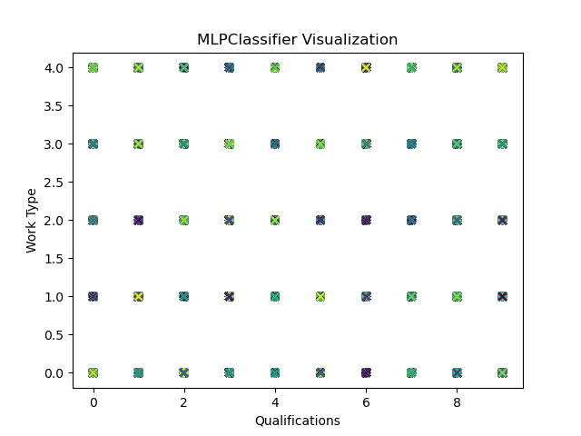

# Лабораторная работа 6. Вариант 15

### Задание
Использовать нейронную сеть MLPClassifier для данных. Интерпретировать результаты и оценить, насколько хорошо она подходит для решения сформулированной задачи.


### Как запустить лабораторную работу
Для запуска программы необходимо с помощью командной строки в корневой директории файлов прокета прописать:
```
python main.py
```
### Какие технологии использовали
- Библиотека *pandas* для работы с данными в формате таблицы.
- Библиотека *matplotlib pyplot* - для визуализации данных.
- Библиотека *sklearn*:
    - *recall_score* и *precision_score* для вычисления полноты и точности соответственно.
    - *train_test_split*  для разделения набора данных на обучающую и тестовую выборки.   
    - *MLPClassifier* для использования многослойный персептрон *MLP*.
    - *StandardScaler* для масштабирования данных перед обучением модели нейронной сети *MLP*.

### Описание лабораторной работы
#### Сформулированная задача
Задачи анализа, решаемые нейронной сетью MLPClassifier: определить локации (страны) по характеристикам вакансий.

#### Оценка важности параметров
Так как аналогичная задача уже решать в лабораторной работе 4, где уже проводилась оценка важности параметров, воспользуемся результатами прошлой оценки.

Наиболее важными параметрами являются 'Qualifications': 1.0, 'Work Type': 1.0, 'Preference': 1.0, 'Job Portal': 1.0, 'Min Experience': 1.0 и все показатели льгот.

#### Нейронная сеть MLPClassifier

Для начала выгружаем CSV-файл с данными о вакансиях работы с помощью функции `read_csv`. Загруженные данные сохраняются в переменной `data`.
Создается целевая переменная `y`, которая содержит столбец `"Country"` из загруженных данных.

Далее создаем функцию `MLP_classifier_country()`, в котором будем производить работу с нейронной сетью. 

Сохраняем копию оригинальных данных в переменной `df`. Затем, из этой копии удаляем столбцы, которые имеют наименьшую важность. Далее, данные разделяем на обучающую и тестовую выборки с помощью функции `train_test_split`. Обучающие данные сохраняются в переменные `X_train` и `y_train`, а тестовые данные - в переменные `X_test` и `y_test`. Здесь `y` представляет собой целевую переменную. 

```python
df = data.copy()
df.drop(['Country', 'location', 'Company Size', 'Preference', 'Job Title', 'Role', 'Job Portal', 'skills', 'Company', 'Min Experience', 'Max Experience', 'Min Salary', 'Max Salary', 'Sector', 'Industry', 'City', 'State', 'Ticker', 'year', 'month', 'day'], axis=1, inplace=True)
X_train, X_test, y_train, y_test = train_test_split(df, y, test_size=0.2)
```

Далее инициализируем объект `mlp` класса `MLPClassifier`, где создаем многослойный персептрон с двумя скрытыми слоя с размерами 100 и 50 соответственно. Алгоритм будет выполнять обучение в течение 20 итераций.

Затем выполняем нормализацию данных с использованием `StandardScaler`. Создаем объект `scaler`, который представляет собой экземпляр класса `StandardScaler`. Затем метод `fit()` вызывается на объекте `scaler`, чтобы оценить параметры масштабирования на основе данных обучения `X_train.values`. Вызываем метод `transform()` на объекте scaler для применения масштабирования к данным обучения `X_train.values` и сохраняем значения в переменную `X_train_scaler` и соотвественно для данных `X_test.values` в переменную `X_test_scaler`.

``` python
scaler = StandardScaler()
scaler.fit(X_train.values)
X_train_scaler = scaler.transform(X_train.values)
X_test_scaler = scaler.transform(X_test.values)
```

Теперь можем обучить модель `mlp` на тренировочных нормализованных значениях признаков тренировочного набора данных. И использовать обученную модель для предсказания меток классов на тестовом наборе данных `X_test_scaler`. Результаты предсказаний сохраняются в переменную `y_pred`. Для определения точности модели воспользуемся функцией `precision_score()`, которая вычисляет точность, сравнивая предсказанные метки классов `y_pred` с истинными метками классов `y_test.values`, указав `average='weighted'`, что нужно учитывать взвешенную точность, учитывая несбалансированность классов. Аналогично вычисляем полноту с помощью функции `recall_score()`.

```python
mlp.fit(X_train_scaler, y_train)
y_pred = mlp.predict(X_test_scaler)
precision = precision_score(y_test.values, y_pred, average='weighted')
recall = recall_score(y_test.values, y_pred, average='weighted')
```
С помощью точности измеряем долю правильно предсказанных положительных примеров относительно всех примеров, которые модель предсказала как положительные, по формуле: *Precision = TP / (TP + FP)*, где *TP (True Positive)* - количество правильно предсказанных положительных примеров, а *FP (False Positive)* - количество неправильно предсказанных положительных примеров.

А с помощью полноты измеряем долю правильно предсказанных положительных примеров относительно всех истинно положительных примеров в данных, по формуле: *Recall = TP / (TP + FN)*, где *FN (False Negative)* - количество неправильно предсказанных отрицательных примеров.

Результат данных метрик выводим в консоль:
```
Precision: 2.1744885682448426e-05
Recall: 0.004663141181912513
```
Также выведем классы, определенные `MLPClassifier` и общее количество возможных вариантов значений `Country` в изначальном наборе данных.
```
Class labels: [  0   1   2   3   4   5   6   7   8   9  10  11  12  13  14  15  16  17
  18  19  20  21  22  23  24  25  26  27  28  29  30  31  32  33  34  35
  36  37  38  39  40  41  42  43  44  45  46  47  48  49  50  51  52  53
  54  55  56  57  58  59  60  61  62  63  64  65  66  67  68  69  70  71
  72  73  74  75  76  77  78  79  80  81  82  83  84  85  86  87  88  89
  90  91  92  93  94  95  96  97  98  99 100 101 102 103 104 105 106 107
 108 109 110 111 112 113 114 115 116 117 118 119 120 121 122 123 124 125
 126 127 128 129 130 131 132 133 134 135 136 137 138 139 140 141 142 143
 144 145 146 147 148 149 150 151 152 153 154 155 156 157 158 159 160 161
 162 163 164 165 166 167 168 169 170 171 172 173 174 175 176 177 178 179
 180 181 182 183 184 185 186 187 188 189 190 191 192 193 194 195 196 197
 198 199 200 201 202 203 204 205 206 207 208 209 210 211 212 213 214 215]
Уникальных Country : 216

```

Выполним построение графика относительно *Work Type* и *Qualifications*:



### Вывод 
Исходя из предоставленных результатов работы MLPClassifier, можно сделать следующие выводы:
- *Precision* (точность) имеет очень низкое значение (2.744885682448426e-05), что означает, что модель очень редко правильно классифицирует положительные примеры. Это может быть связано с высоким количеством ложно положительных предсказаний (*FP*).
- *Recall* (полнота) также имеет низкое значение (0.004663141181912513), что означает, что модель неспособна обнаружить большую часть истинно положительных примеров. Это может быть связано с высоким количеством ложно отрицательных предсказаний (*FN*).

Таким образом, результаты указывают на низкую эффективность модели MLPClassifier в данной задаче классификации. Требуется дальнейшая настройка модели или использование других алгоритмов для достижения лучших результатов.
