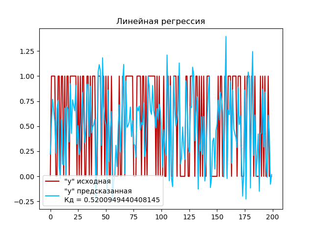
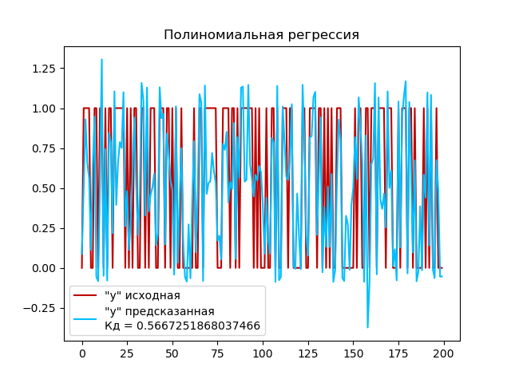
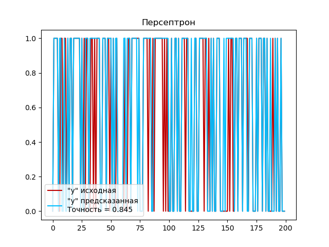

# Лабораторная работа 1. Вариант 15

### Задание
Сгенерировать данные: 
`
make_classification (n_samples=500, n_features=2,
n_redundant=0, n_informative=2, random_state=rs, n_clusters_per_class=1) 
`

Сравнить на нем 3 модели:
- Линейную регрессию
- Полиномиальную регрессию (со степенью 4)
- Персептрон

### Как запустить лабораторную работу
Для запуска программы необходимо с помощью командной строки в корневой директории файлов прокета прописать:
```
python main.py
```
### Какие технологии использовали
- Библиотека *numpy* для работы с массивами.
- Библиотека *matplotlib pyplot* - для визуализации данных.
- Библиотека *sklearn*:
    - *make_classification* для создания синтетических наборов данных.
    - *LinearRegression* для создания и работы с моделью Линейной регрессии.
    - *Perceptron* для создания и работы с Персептроном
    - *accuracy_score* для использования функции, используемая для вычисления точности классификации.
    - *train_test_split*  для разделения набора данных на обучающую и тестовую выборки.
    - *PolynomialFeatures* для создания преобразователя, который генерирует полиномиальные признаки из исходных признаков

### Описание лабораторной работы
#### Генерация данных
Программа создает синтетический набор данных, где переменная `X` будет содержать матрицу признаков размером `(n_samples, n_features)`, а переменная `y` будет содержать вектор целевых переменных размером `(n_samples,)`.
```
X, y = make_classification(n_samples=500, n_features=2, n_redundant=0,
                           n_informative=2, random_state=None,
                           n_clusters_per_class=1)
```
Добавляет шум к данным путем увеличения значений матрицы признаков `X` на случайные значения из равномерного распределения, умноженные на 2. Затем создает переменную, которая содержит кортеж из матрицы признаков `X` и вектора целевых переменных `y`. И разделяет данные на обучающий набор `(X_train, y_train)` и тестовый набор `(X_test, y_test)` с помощью функции `train_test_split`. Обучающий набор составляет 60% от исходных данных, а 40% от исходных данных используются для тестирования модели  `(test_size=.4)`.
```python
rng = np.random.RandomState(2)
X += 2 * rng.uniform(size=X.shape)
linearly_dataset = (X, y)
X_train, X_test, y_train, y_test = train_test_split(X, y, test_size=.4, random_state=42)
```
#### Работа с моделью линейной регрессии
Создаем экземпляр модели линейной регрессии с помощью класса `LinearRegression()`, которая будет использоваться для построения линейной регрессии. Обучаем модель на обучающем наборе данных `X_train` и `y_train` с помощью метода `fit()`. Затем используем обученную модель для прогнозирования целевых переменных на тестовом наборе данных `X_test` с помощью метода `predict()`. Полученные прогнозы сохраняются в переменную `y_pred`. И вычисляем коэффициент детерминации (R-квадрат) для для оценки качества модели регрессии на тестовом наборе данных с помощью метода `score()`.
```python
# Модель линейной регрессии
model = LinearRegression()
# Обучение на тренировочных данных
model.fit(X_train, y_train)
# Выполнение прогноза
y_pred = model.predict(X_test)
# Вычисление коэффициента детерминации
r_sq = model.score(X_test, y_test)
```
Выполним построение графика:




#### Работа с моделью полиномиальной регрессии (со степенью 4)
Создаем экземпляр класса `PolynomialFeatures` для генерации полиномиальных признаков со степень полинома 4 и параметр `include_bias=False`, чтобы исключить добавление дополнительного столбца с единицами (смещения). Преобразуем обучающий набор данных `X_train` и тестовый набор данных `X_test`  в полиномиальные признаки с помощью метода `fit_transform()` и сохраняем в переменные `X_poly_train` и `X_poly_test` соотвественно. Создаем экземпляр модели линейной регрессии с помощью класса `LinearRegression()`. Обучаем модель линейной регрессии на обучающем наборе данных `X_poly_train` и `y_train` с помощью метода `fit()`. Используем обученную модель для прогнозирования целевых переменных на тестовом наборе данных `X_poly_test` с помощью метода `predict()`. И вычисляем коэффициент детерминации (R-квадрат) для модели на тестовом наборе данных с помощью метода `score()`.
```python
pf = PolynomialFeatures(degree=4, include_bias=False)
# Преобразование исходного набора данных X_train в полиномиальные признаки
X_poly_train = pf.fit_transform(X_train)
# Преобразование исходного набора данных X_test в полиномиальные признаки
X_poly_test = pf.fit_transform(X_test)
# Модель линейной регрессии
model = LinearRegression()
# Обучение модели линейной регрессии на преобразованных полиномиальных признаках
model.fit(X_poly_train, y_train)
# Выполнение прогноза
y_pred = model.predict(X_poly_test)
# Вычисление коэффициента детерминации
r_sq = model.score(X_poly_test, y_test)
```
Выполним построение графика:




#### Работа с персептроном
Создаем экземпляр модели персептрона `model = Perceptron()` и  обучаем модель на тренировочных данных с помощью метода `fit()`. После обучения модели персептрона, выполняем прогноз на тестовых данных с помощью метода `predict()`. Для оценки точности работы персептрона используем функцию `accuracy_score`, которая сравнивает предсказанные классы `y_pred` с истинными классами `y_test` и возвращает долю правильно классифицированных примеров.
```python
# Модель персептрона
model = Perceptron()
# Обучение на тренировочных данных
model.fit(X_train, y_train)
# Выполнение прогноза
y_pred = model.predict(X_test)
# Вычисление точности работы персептрона
accuracy = accuracy_score(y_test, y_pred)
```
Выполним построение графика:




### Вывод

Исходя из построенных графиков можно сделать следующий вывод:

1. Коэффициент детерминации для полиномиальной регрессии (0,56) выше, чем для линейной регрессии (0,52). Это означает, что полиномиальная модель лучше объясняет изменчивость в данных, чем линейная модель. Однако значение 0.56 указывает на некоторую связь между предсказываемой переменной и независимыми переменными, но остается возможность для дальнейшего улучшения модели.

2. Доля правильно классифицированных примеров персептроном (0,845) также высокая. Это говорит о том, что персептрон успешно выполнил задачу классификации и хорошо разделил примеры на правильные классы.

В целом, можно сделать вывод, что и полиномиальная регрессия и персептрон проявляют лучшую производительность и демонстрируют лучшие результаты в анализе сгенерированных нами данных, чем линейная регрессия.