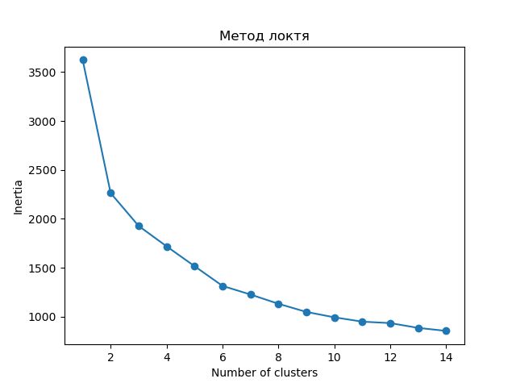
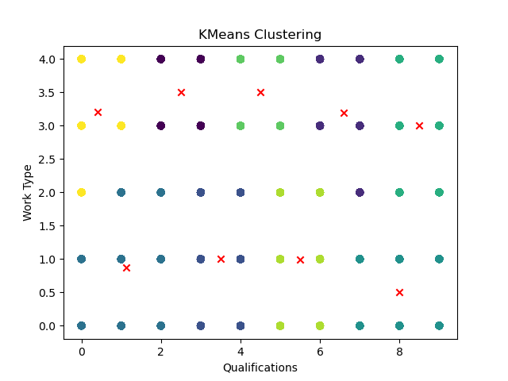

# Лабораторная работа 4. Вариант 15

### Задание
Использовать алгоритм кластеризации *K-means*, самостоятельно сформулировав задачу. Интерпретировать результаты и оценить, насколько хорошо он подходит для решения сформулированной задачи.

### Как запустить лабораторную работу
Для запуска программы необходимо с помощью командной строки в корневой директории файлов прокета прописать:
```
python main.py
```
### Какие технологии использовали
- Библиотека *numpy* для работы с массивами.
- Библиотека *pandas* для работы с данными в формате таблицы.
- Библиотека *matplotlib pyplot* - для визуализации данных.
- Библиотека *sklearn*:
    - *KMeans* для использования алгоритма кластеризации K-средних.
    - *train_test_split*  для разделения набора данных на обучающую и тестовую выборки.    
    - *LinearRegression* для создания и работы с моделью Линейной регрессии.
    - RFE для рекурсивного отбора признаков

### Описание лабораторной работы
#### Сформулированная задача
Задача анализа, решаемые алгоритмом кластеризации: выделить локации (страны) с похожими характеристиками вакансий для определения региональных тенденций и особенностей рынка труда.

#### Оценка важности параметров
Прежде, чем перейти к решению поставленной задачи. Произведем анализ важности параметров, чтобы выделить наиболее существенные характеристики, которые влияют на выделение лакаций с похожиим характеристиками. Для этого создадим функцию `recursive_feature_elimination()`, где создаем копию исходного датафрейма `data` и присваивается переменной `df`. В `df` удаляем столбцы `"Country"` и `"location"` с помощью метода `drop()`, т.к. на данных столбца `"Country"` будем использовать как целеввые значения (заранее пропишем `y = data['Country']` общий для всех функций, которые создадим в дальнейшем). Данные разделяем на обучающую и тестовую выборки с использованием функции `train_test_split()`. Размер тестовой выборки составляет 20% от исходных данных. Разделенные данные сохраняются в переменные `X_train`, `X_test`, `y_train` и `y_test`. Задаем имена столбцов датасета в переменной `column_names`, которые будем использовать для вывода данных. Далее для ранжирования важности параметров создаем экземпляры модели линейной регрессии `LinearRegression()` и модели RFE, которую обучаем на обучающих данных с помощью метода `fit()`. Для сортировки полученных результатов воспользуемся функцией  `rank_to_dict_rfe(ranking, names)` из прошлой лабораторной работы.

```python
def recursive_feature_elimination():
    df = data.copy()
    df.drop(["Country", "location"], axis=1, inplace=True)
    X_train, X_test, y_train, y_test = train_test_split(df, y, test_size=0.2)
    column_names = ['Qualifications', 'Work Type', 'Company Size', 'Preference', 'Job Title', 'Role', 'Job Portal',
                    'skills', 'Company', 'Min Experience', 'Max Experience', 'Min Salary',
                    'Max Salary', 'Sector', 'Industry', 'City', 'State', 'Ticker', 'year', 'month', 'day',
                    "'Casual Dress Code, Social and Recreational Activities, Employee Referral Programs, Health and Wellness Facilities, Life and Disability Insurance'",
                    "'Childcare Assistance, Paid Time Off (PTO), Relocation Assistance, Flexible Work Arrangements, Professional Development'",
                    "'Employee Assistance Programs (EAP), Tuition Reimbursement, Profit-Sharing, Transportation Benefits, Parental Leave'",
                    "'Employee Referral Programs, Financial Counseling, Health and Wellness Facilities, Casual Dress Code, Flexible Spending Accounts (FSAs)'",
                    "'Flexible Spending Accounts (FSAs), Relocation Assistance, Legal Assistance, Employee Recognition Programs, Financial Counseling'",
                    "'Health Insurance, Retirement Plans, Flexible Work Arrangements, Employee Assistance Programs (EAP), Bonuses and Incentive Programs'",
                    "'Health Insurance, Retirement Plans, Paid Time Off (PTO), Flexible Work Arrangements, Employee Assistance Programs (EAP)'",
                    "'Legal Assistance, Bonuses and Incentive Programs, Wellness Programs, Employee Discounts, Retirement Plans'",
                    "'Life and Disability Insurance, Stock Options or Equity Grants, Employee Recognition Programs, Health Insurance, Social and Recreational Activities'",
                    "'Transportation Benefits, Professional Development, Bonuses and Incentive Programs, Profit-Sharing, Employee Discounts'",
                    "'Tuition Reimbursement, Stock Options or Equity Grants, Parental Leave, Wellness Programs, Childcare Assistance'"]

    estimator = LinearRegression()
    rfe_model = RFE(estimator)
    rfe_model.fit(X_train.values, y_train.values)
    ranks = rank_to_dict_rfe(rfe_model.ranking_, column_names)
    sorted_dict = dict(sorted(ranks.items(), key=lambda x: x[1], reverse=True))
    print(sorted_dict)

def rank_to_dict_rfe(ranking, names):
    n_ranks = [float(1 / i) for i in ranking]
    n_ranks = map(lambda x: round(x, 2), n_ranks)
    return dict(zip(names, n_ranks))
```
После запуска функции `recursive_feature_elimination()`, получаем следующий результат:
```
{'Qualifications': 1.0, 'Work Type': 1.0, 'Preference': 1.0, 'Job Portal': 1.0, 'Min Experience': 1.0, "'Casual Dress Code, Social and Recreational Activities, Employee Referral Programs, Health and Wellness Facilities, Life and Disability Insurance'": 1.0, "'Childcare Assistance, Paid Time Off (PTO), Relocation Assistance, Flexible Work Arrangements, Professional Development'": 1.0, "'Employee Assistance Programs (EAP), Tuition Reimbursement, Profit-Sharing, Transportation Benefits, Parental Leave'": 1.0, "'Employee Referral Programs, Financial Counseling, Health and Wellness Facilities, Casual Dress Code, Flexible Spending Accounts (FSAs)'": 1.0, "'Flexible Spending Accounts (FSAs), Relocation Assistance, Legal Assistance, Employee Recognition Programs, Financial Counseling'": 1.0, "'Health Insurance, Retirement Plans, Flexible Work Arrangements, Employee Assistance Programs (EAP), Bonuses and Incentive Programs'": 1.0, "'Health Insurance, Retirement Plans, Paid Time Off (PTO), Flexible Work Arrangements, Employee Assistance Programs (EAP)'": 1.0, "'Legal Assistance, Bonuses and Incentive Programs, Wellness Programs, Employee Discounts, Retirement Plans'": 1.0, "'Life and Disability Insurance, Stock Options or Equity Grants, Employee Recognition Programs, Health Insurance, Social and Recreational Activities'": 1.0, "'Transportation Benefits, Professional Development, Bonuses and Incentive Programs, Profit-Sharing, Employee Discounts'": 1.0, "'Tuition Reimbursement, Stock Options or Equity Grants, Parental Leave, Wellness Programs, Childcare Assistance'": 1.0, 'month': 0.5, 'year': 0.33, 'Max Experience': 0.25, 'State': 0.2, 'day': 0.17, 'Sector': 0.14, 'Company': 0.12, 'Ticker': 0.11, 'Job Title': 0.1, 'Role': 0.09, 'Industry': 0.08, 'City': 0.08, 'skills': 0.07, 'Min Salary': 0.07, 'Company Size': 0.06, 'Max Salary': 0.06}
```
Как можно заметить, наиболее важными параметрами являются 'Qualifications': 1.0, 'Work Type': 1.0, 'Preference': 1.0, 'Job Portal': 1.0, 'Min Experience': 1.0 и все показатели льгот.

#### Оценка количества кластеров
Для оценки количества кластеров воспользуемся методом локтя - графический метод для оценки оптимального количества кластеров при использовании алгоритма k-means. Данный метод основан на расчете суммы квадратов расстояний между каждым объектом данных и центроидом его кластера. Эта сумма называется инерцией. Чем меньше инерция, тем лучше кластеризация. 

Сначала создаем копию данных `df`, после чего удаляем ненужных столбцов из `df` с помощью метода `drop()`. Затем данные разделяем на обучающую и тестовую выборки с помощью функции `train_test_split()`.
Далее инициализируем пустой список `inertias`, который будет хранить значения инерции для различного количества кластеров. В цикле for перебираем значения `k` от 1 до 14. Внутри цикла создаем объект KMeans с параметром `n_clusters=k`, который выполняет кластеризацию обучающей выборки. Значение инерции для текущего количества кластеров добавляется в список `inertias`.
После завершения цикла строим график метода локтя, где по оси *x* отображается количество кластеров, а по оси *y* - значение инерции.

С помощью графика выберем точку, где изменение инерции становится менее значительным по сравнению с предыдущими значениями.

``` python
df = data.copy()
    df.drop(['Country', 'location', 'Company Size', 'Job Title', 'Role',
             'skills', 'Company', 'Max Experience', 'Min Salary',
             'Max Salary', 'Sector', 'Industry', 'City', 'State', 'Ticker', 'year', 'month', 'day'           
             ],
            axis=1, inplace=True)
    X_train, X_test, y_train, y_test = train_test_split(df, y, test_size=0.2)
    inertias = []
    for k in range(1, 15):
        kmeans = KMeans(n_clusters=k, random_state=1).fit(X_train.values, y_train.values)
        inertias.append(np.sqrt(kmeans.inertia_))
    plt.plot(range(1, 15), inertias, marker='o')
    plt.xlabel('Number of clusters')
    plt.ylabel('Inertia')
    plt.title("Метод локтя")
    plt.savefig('static/charts/ElbowMethod.png')
    plt.close()
```
Выполним построение графика:




Таким образом, с помощью метода локтя получилось визуально определить оптимальное количество кластеров для алгоритма k-means на основе значения инерции, равное 9.

#### Алгоритм кластеризации *K-means*
Для работы с алгоритмом кластеризации *K-means* создадим функцию `k_means()` . Сохраняем копию оригинальных данных в переменной `df`. Затем, из этой копии удаляем столбцы, которые имеют наименьшую важность. Далее, данные разделяем на обучающую и тестовую выборки с помощью функции `train_test_split`. Обучающие данные сохраняются в переменные `X_train` и `y_train`, а тестовые данные - в переменные `X_test` и `y_test`. Здесь `y` представляет собой целевую переменную. Затем, создаем объект `kmeans` класса KMeans с параметром `n_clusters=9`, что означает, что алгоритм будет искать 9 кластеров в данных. Обучение модели выполняется с помощью метода `fit`, передавая в него значения `X_train` и `y_train`.Далее, применяется обученная модель к тестовым данным с помощью метода `predict`, чтобы получить метки кластеров. Координаты центроидов кластеров сохраняются в переменной `centroids`.

```python
def k_means():
    df = data.copy()
    df.drop(['Country', 'location', 'Company Size', 'Preference', 'Job Title', 'Role', 'Job Portal',
             'skills', 'Company', 'Min Experience', 'Max Experience', 'Min Salary',
             'Max Salary', 'Sector', 'Industry', 'City', 'State', 'Ticker', 'year', 'month', 'day',
             "'Casual Dress Code, Social and Recreational Activities, Employee Referral Programs, Health and Wellness Facilities, Life and Disability Insurance'",
             "'Childcare Assistance, Paid Time Off (PTO), Relocation Assistance, Flexible Work Arrangements, Professional Development'",
             "'Employee Assistance Programs (EAP), Tuition Reimbursement, Profit-Sharing, Transportation Benefits, Parental Leave'",
             "'Employee Referral Programs, Financial Counseling, Health and Wellness Facilities, Casual Dress Code, Flexible Spending Accounts (FSAs)'",
             "'Flexible Spending Accounts (FSAs), Relocation Assistance, Legal Assistance, Employee Recognition Programs, Financial Counseling'",
             "'Health Insurance, Retirement Plans, Flexible Work Arrangements, Employee Assistance Programs (EAP), Bonuses and Incentive Programs'",
             "'Health Insurance, Retirement Plans, Paid Time Off (PTO), Flexible Work Arrangements, Employee Assistance Programs (EAP)'",
             "'Legal Assistance, Bonuses and Incentive Programs, Wellness Programs, Employee Discounts, Retirement Plans'",
             "'Life and Disability Insurance, Stock Options or Equity Grants, Employee Recognition Programs, Health Insurance, Social and Recreational Activities'",
             "'Transportation Benefits, Professional Development, Bonuses and Incentive Programs, Profit-Sharing, Employee Discounts'",
             "'Tuition Reimbursement, Stock Options or Equity Grants, Parental Leave, Wellness Programs, Childcare Assistance'"],
            axis=1, inplace=True)
    X_train, X_test, y_train, y_test = train_test_split(df, y, test_size=0.2)
    kmeans = KMeans(n_clusters=9)
    kmeans.fit(X_train.values, y_train.values)
    labels = kmeans.predict(X_test.values)
    centroids = kmeans.cluster_centers_
    print("Метки кластеров:", labels)
    print("Координаты центроидов:", centroids)
    plt.scatter(X_test['Qualifications'], X_test['Work Type'], c=labels, cmap='viridis')
    plt.scatter(centroids[:, 0], centroids[:, 1], marker='x', color='red')
    plt.xlabel('Qualifications')
    plt.ylabel('Work Type')
    plt.title('KMeans Clustering')
    plt.savefig('static/charts/KMeansClustering.png')
    plt.close()

    print("Уникальных Work Type :", data['Work Type'].nunique())
    print("Уникальных Qualifications:", data['Qualifications'].nunique())

    unique_labels = np.unique(labels)
    for label in unique_labels:
        indices = np.where(labels == label)
        y_values = data_orig.loc[indices, 'Country']
        print(f"Значения y для кластера {label}: {y_values}")
```
Выполним построение графика:




Также выводим результаты работы алгоритма кластеризации в консоль, где можно увидеть подробные результаты разбиения на кластеры:

```
Значения y для кластера 0: 9         Antigua and Barbuda
16                 San Marino
21                     Tuvalu
22                    Eritrea
35              New Caledonia
                 ...         
319899                  Nepal
319912             Uzbekistan
319927               Colombia
319933                  Spain
319955                  Niger
Name: Country, Length: 25672, dtype: object
Значения y для кластера 1: 10                             Bahrain
14                Syrian Arab Republic
19        Democratic Republic Of Congo
31                               Chile
40                       Cote d'Ivoire
                      ...             
319904                      Mauritania
319905                Macao SAR, China
319906                         Vietnam
319929                French Polynesia
319945                       Mauritius
Name: Country, Length: 31971, dtype: object
Значения y для кластера 2: 7          Sao Tome and Principe
15                         Yemen
17              French Polynesia
20                    Azerbaijan
24        British Virgin Islands
                   ...          
319935        Dominican Republic
319937                     Japan
319938                    Gambia
319946                 Indonesia
319949                    Latvia
Name: Country, Length: 38400, dtype: object
Значения y для кластера 3: 0                       Isle of Man
6                    Cayman Islands
11                          Bermuda
23                         Honduras
30                           Jordan
                    ...            
319931    Sint Maarten (Dutch part)
319942         Hong Kong SAR, China
319943                   Bangladesh
319950                      Croatia
319952         Syrian Arab Republic
Name: Country, Length: 51148, dtype: object
Значения y для кластера 4: 3               Benin
4               Chile
5             Belgium
12            Jamaica
18        North Korea
             ...     
319922          Gabon
319925    Korea, Rep.
319926       Ethiopia
319941       Zimbabwe
319951    Korea, Rep.
Name: Country, Length: 38574, dtype: object
Значения y для кластера 5: 1                  Turkmenistan
38              Solomon Islands
42        Virgin Islands (U.S.)
47                       Belize
59            Republic Of Congo
                  ...          
319918                    Spain
319924                 Paraguay
319947                   Brazil
319948         Macao SAR, China
319953                    China
Name: Country, Length: 38422, dtype: object
Значения y для кластера 6: 37               West Bank and Gaza
57                             Guam
102                            Fiji
111                         Ecuador
124                      Cabo Verde
                    ...            
319896    Sint Maarten (Dutch part)
319903                   Madagascar
319914                 South Africa
319940                  Netherlands
319954                      Albania
Name: Country, Length: 25701, dtype: object
Значения y для кластера 7: 2                 Macao SAR, China
8                         Maldives
13                          Gambia
25                            Cuba
27                          Gambia
                    ...           
319892    Turks and Caicos Islands
319920                  Luxembourg
319923         Trinidad and Tobago
319939                       China
319944                        Fiji
Name: Country, Length: 38449, dtype: object
Значения y для кластера 8: 48                      Malta
49                     Panama
52          Republic Of Congo
81                 Bangladesh
82                      Nepal
                 ...         
319902               Cambodia
319921               Barbados
319932                Lesotho
319934    St. Kitts and Nevis
319936                Nigeria
Name: Country, Length: 31619, dtype: object
```

Также выведем координаты центроидов: 
```
Координаты центроидов: [[2.49909662 0.4986962 ]
 [6.49757212 3.00005221]
 [1.12332665 3.12941867]
 [6.79715885 0.40238426]
 [3.99726263 3.50030885]
 [8.50117367 3.49953735]
 [4.2877207  1.14426123]
 [8.60271303 1.19776253]
 [0.40101301 0.79759215]]
```

И оценим качество кластеризации, используя силуэтный коэффициент и индекс Дэвиса-Болдина:
1. Силуэтный коэффициент - это метрика, которая измеряет, насколько точка хорошо соответствует своему собственному кластеру в сравнении с другими кластерами. Он находится в диапазоне от -1 до 1, где значение ближе к 1 указывает на хорошую кластеризацию, а значение ближе к -1 указывает на плохую кластеризацию.
```python
    # Оценка силуэтного коэффициента
    silhouette = silhouette_score(X_test.values, kmeans.predict(X_test.values))
    print("Силуэтный коэффициент:", silhouette)
```
В нашем случае силуэтный коэффициент равен 0.4086103390706535. 
2. Индекс Дэвиса-Болдина - это метрика, которая измеряет сходство между кластерами на основе их средних расстояний и средних расстояний между кластерами. Чем меньше значение этого индекса, тем лучше кластеризация. 
```python
    # Оценка индекса Дэвиса-Болдина
    davies_bouldin = davies_bouldin_score(X_test.values, kmeans.predict(X_test.values))
    print("Индекс Дэвиса-Болдина:", davies_bouldin)
```
В нашем случае индекс Дэвиса-Болдина равен 0.8682047121172671. 

### Вывод

Таким образом, с помощью оценок силуэтного коэффициента и индекса Дэвиса-Болдина, можно сделать следующие выводы о качестве кластеризации:
1. Силуэтный коэффициент равен 0.4086103390706535. В данном случае, значение силуэтного коэффициента выше 0, что говорит о том, что кластеры имеют некоторую степень разделения, но не являются идеально разделимыми. В целом, это может указывать на некоторое качество кластеризации, но не является оптимальным.
2. Индекс Дэвиса-Болдина равен 0.8682047121172671. Значение этого индекса является положительным числом. В данном случае, значение индекса Дэвиса-Болдина выше 0, что указывает на некоторое сходство между кластерами.

Таким образом, на основе предоставленных значений можно сказать, что кластеризация имеет некоторую степень разделения, но не является идеальной.