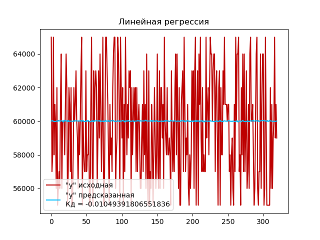
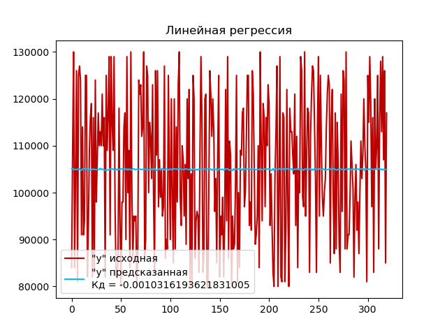

# Лабораторная работа 5. Вариант 15

### Задание
Использовать линейную регрессию, самостоятельно сформулировав задачу.

### Как запустить лабораторную работу
Для запуска программы необходимо с помощью командной строки в корневой директории файлов прокета прописать:
```
python main.py
```
### Какие технологии использовали
- Библиотека *numpy* для работы с массивами.
- Библиотека *pandas* для работы с данными в формате таблицы.
- Библиотека *matplotlib pyplot* - для визуализации данных.
- Библиотека *sklearn*:
    - *LinearRegression* для создания и работы с моделью Линейной регрессии.
    - *train_test_split*  для разделения набора данных на обучающую и тестовую выборки.
    - RFE для рекурсивного отбора признаков

### Описание лабораторной работы
#### Сформулированная задача
Задачи анализа, решаемая регрессией: предсказать диапазон окладов на основе других признаков.
#### Оценка важности параметров

Для решения данной задачи будем рассматривать отдельно столбцы `"Max Salary"` и `"Min Salary"`, а также произведем оценку важности отстальных параметров/столбцов датасета с помощью алгоритма RFE, аналогично прошлой лабораторной работе.

В результате получаем следующее:
```
Оценка важности параметров для нахождения минимальной оплаты труда
{'Qualifications': 1.0, 'Work Type': 1.0, 'Preference': 1.0, 'Min Experience': 1.0, 'Max Experience': 1.0, 'day': 1.0, "'Casual Dress Code, Social and Recreational Activities, Employee Referral Programs, Health and Wellness Facilities, Life and Disability Insurance'": 1.0, "'Childcare Assistance, Paid Time Off (PTO), Relocation Assistance, Flexible Work Arrangements, Professional Development'": 1.0, "'Employee Assistance Programs (EAP), Tuition Reimbursement, Profit-Sharing, Transportation Benefits, Parental Leave'": 1.0, "'Employee Referral Programs, Financial Counseling, Health and Wellness Facilities, Casual Dress Code, Flexible Spending Accounts (FSAs)'": 1.0, "'Flexible Spending Accounts (FSAs), Relocation Assistance, Legal Assistance, Employee Recognition Programs, Financial Counseling'": 1.0, "'Health Insurance, Retirement Plans, Flexible Work Arrangements, Employee Assistance Programs (EAP), Bonuses and Incentive Programs'": 1.0, "'Legal Assistance, Bonuses and Incentive Programs, Wellness Programs, Employee Discounts, Retirement Plans'": 1.0, "'Life and Disability Insurance, Stock Options or Equity Grants, Employee Recognition Programs, Health Insurance, Social and Recreational Activities'": 1.0, "'Transportation Benefits, Professional Development, Bonuses and Incentive Programs, Profit-Sharing, Employee Discounts'": 1.0, "'Tuition Reimbursement, Stock Options or Equity Grants, Parental Leave, Wellness Programs, Childcare Assistance'": 1.0, "'Health Insurance, Retirement Plans, Paid Time Off (PTO), Flexible Work Arrangements, Employee Assistance Programs (EAP)'": 0.5, 'year': 0.33, 'month': 0.25, 'State': 0.2, 'location': 0.17, 'Country': 0.14, 'Role': 0.12, 'Job Portal': 0.11, 'City': 0.1, 'Industry': 0.09, 'Job Title': 0.08, 'skills': 0.08, 'Company': 0.07, 'Sector': 0.07, 'Company Size': 0.06, 'Max Salary': 0.06, 'Ticker': 0.06}
Оценка важности параметров для нахождения максимальной оплаты труда
{'Work Type': 1.0, 'Preference': 1.0, 'Min Experience': 1.0, 'Max Experience': 1.0, 'year': 1.0, "'Casual Dress Code, Social and Recreational Activities, Employee Referral Programs, Health and Wellness Facilities, Life and Disability Insurance'": 1.0, "'Childcare Assistance, Paid Time Off (PTO), Relocation Assistance, Flexible Work Arrangements, Professional Development'": 1.0, "'Employee Assistance Programs (EAP), Tuition Reimbursement, Profit-Sharing, Transportation Benefits, Parental Leave'": 1.0, "'Employee Referral Programs, Financial Counseling, Health and Wellness Facilities, Casual Dress Code, Flexible Spending Accounts (FSAs)'": 1.0, "'Flexible Spending Accounts (FSAs), Relocation Assistance, Legal Assistance, Employee Recognition Programs, Financial Counseling'": 1.0, "'Health Insurance, Retirement Plans, Flexible Work Arrangements, Employee Assistance Programs (EAP), Bonuses and Incentive Programs'": 1.0, "'Health Insurance, Retirement Plans, Paid Time Off (PTO), Flexible Work Arrangements, Employee Assistance Programs (EAP)'": 1.0, "'Legal Assistance, Bonuses and Incentive Programs, Wellness Programs, Employee Discounts, Retirement Plans'": 1.0, "'Life and Disability Insurance, Stock Options or Equity Grants, Employee Recognition Programs, Health Insurance, Social and Recreational Activities'": 1.0, "'Transportation Benefits, Professional Development, Bonuses and Incentive Programs, Profit-Sharing, Employee Discounts'": 1.0, "'Tuition Reimbursement, Stock Options or Equity Grants, Parental Leave, Wellness Programs, Childcare Assistance'": 1.0, 'month': 0.5, 'Country': 0.33, 'location': 0.25, 'day': 0.2, 'Qualifications': 0.17, 'State': 0.14, 'Sector': 0.12, 'Industry': 0.11, 'Role': 0.1, 'Ticker': 0.09, 'Job Portal': 0.08, 'Company': 0.08, 'skills': 0.07, 'City': 0.07, 'Company Size': 0.06, 'Job Title': 0.06, 'Min Salary': 0.06}
```

Как можно заметить наиболее значимые параметры для столбцов `"Max Salary"` и `"Min Salary"` почти аналогичны, однако для `"Min Salary"` также важен параметр `"Qualifications"`, а для `"Max Salary"` - `"year"`.

#### Линейная регрессия
Для предсказать диапазон окладов на основе других признаков создадим два метода для столбцов `"Max Salary"` и `"Min Salary"`, где скопируем данные датасета и удалим из него столбец целевого значения и столбцы/параматеры, которые имеют наименьшую значимость.

Затем, разделим датасет на тестувую и обучающую выборк, создаем экземпляр модели линейной регрессии с помощью класса `LinearRegression()`, которая будет использоваться для построения линейной регрессии. Обучаем модель на обучающем наборе данных `X_train` и `y_train` с помощью метода `fit()`. Затем используем обученную модель для прогнозирования целевых переменных на тестовом наборе данных `X_test` с помощью метода `predict()`. Полученные прогнозы сохраняются в переменную `y_pred`. И вычисляем коэффициент детерминации (R-квадрат) для для оценки качества модели регрессии на тестовом наборе данных с помощью метода `score()`.

Выполним построение графиков:






### Вывод 
Исходя из данных графиков, можно сделать вывод о том, что модели линейной регрессии не объясняют вариацию в данных и дают негативное значение, т.к. коэффициент детерминации равен *-0,00104...*.Обычно, отрицательное значение коэффициента детерминации указывает на то, что модель показывает худшие результаты, чем простая горизонтальная линия, которая является наихудшим предсказанием.

Исходя из этого, можно сделать вывод, что линейная регрессия, представленная данной моделью, плохо соответствует данным и не объясняет вариацию в данных. Возможно, требуется рассмотреть другие модели или улучшить текущую модель, чтобы достичь более точных предсказаний.